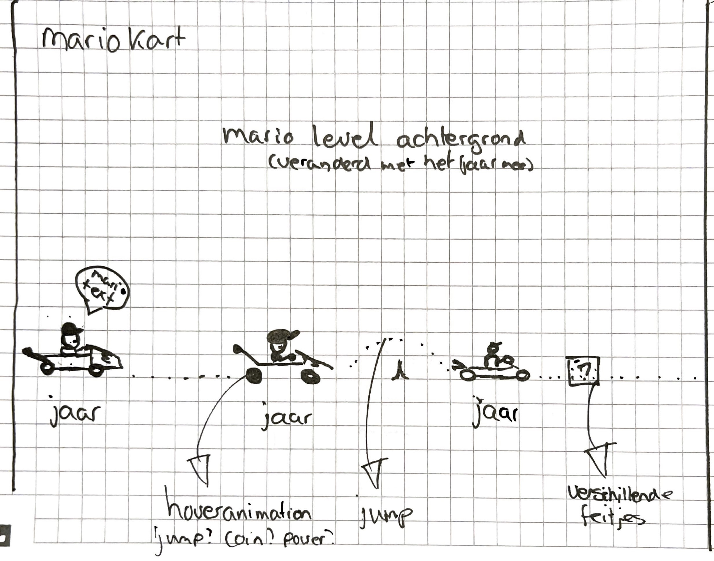
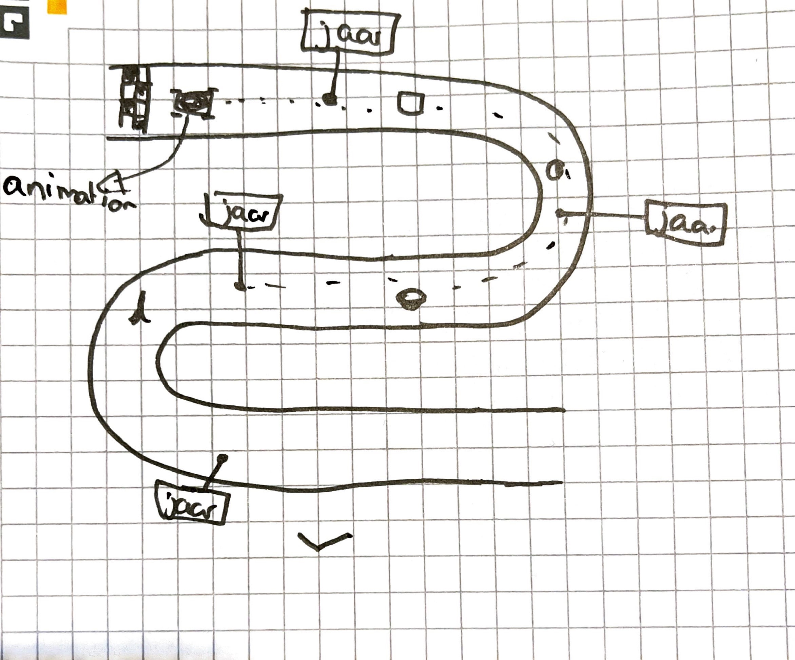
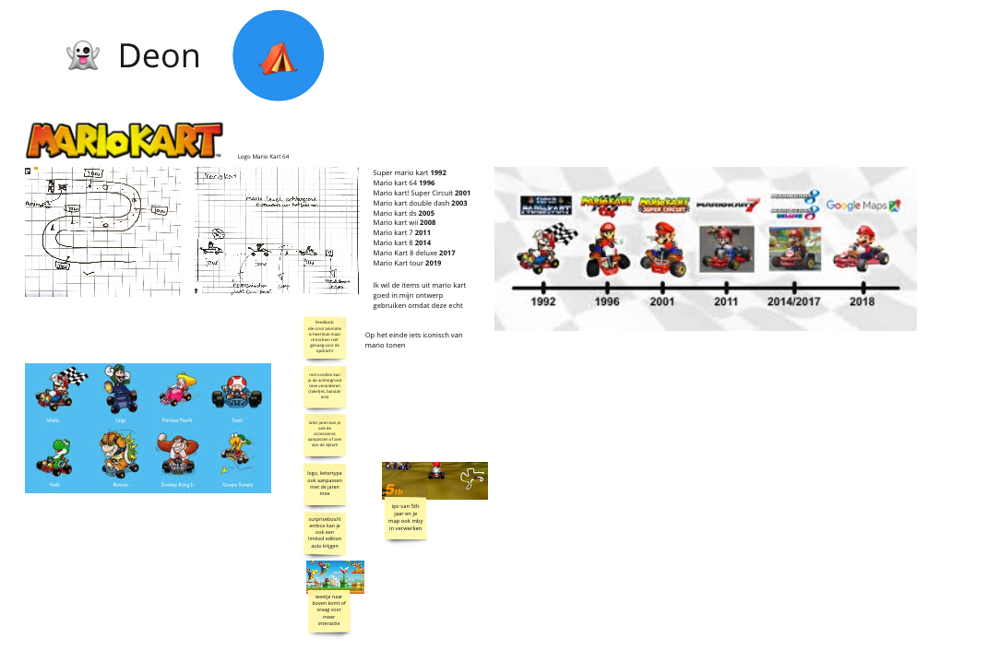
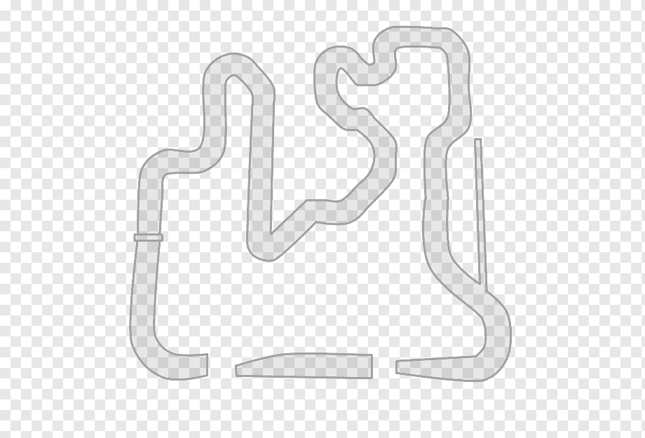
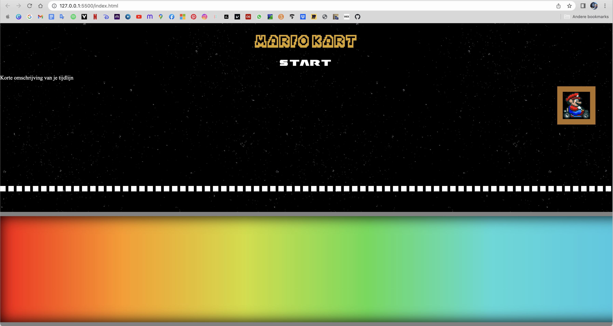
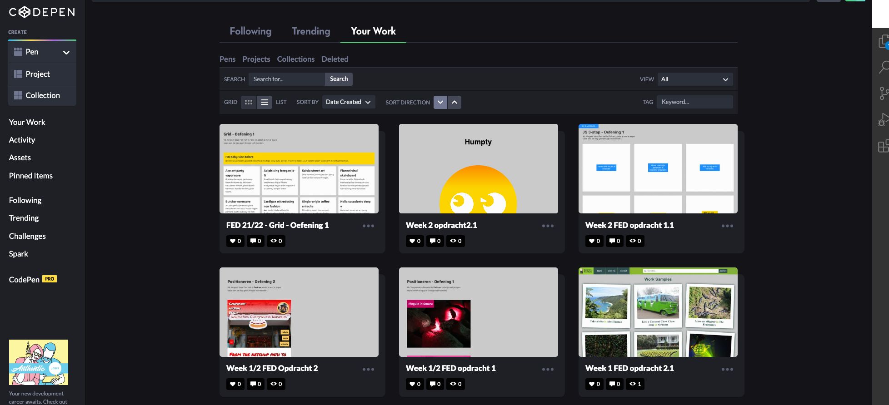
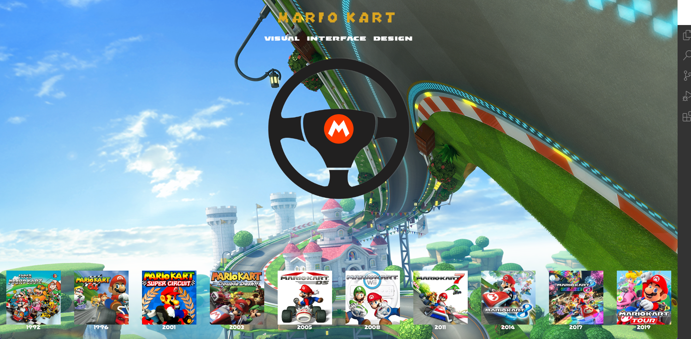
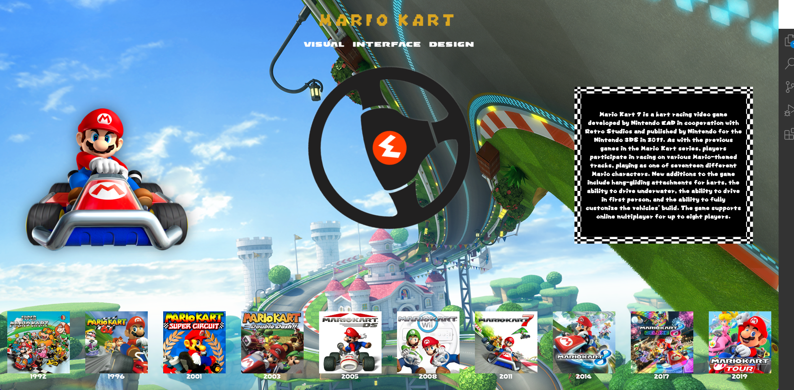
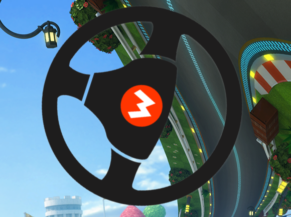

# Procesverslag
Markdown is een simpele manier om HTML te schrijven.  
Markdown cheat cheet: [Hulp bij het schrijven van Markdown](https://github.com/adam-p/markdown-here/wiki/Markdown-Cheatsheet).

Nb. De standaardstructuur en de spartaanse opmaak van de README.md zijn helemaal prima. Het gaat om de inhoud van je procesverslag. Besteedt de tijd voor pracht en praal aan je website.

Nb. Door *open* toe te voegen aan een *details* element kun je deze standaard open zetten. Fijn om dat steeds voor de relevante stuk(ken) te doen.

## Jij

### Ontwerper:
Deon Blok

#### Je startniveau:
Blauw! 

# Je plan

  
De eerste versie/schets van je ontwerp & je persoonlijke uitdaging.

  ### De eerste versie/schets:
  
  

  ### Je ambitie: 
  Aan deze technieken/punten wil ik werken:
  - Ik wil graag beter worden in het coderen op gebied van html, css en javascript.
  - Ik wil meer plezier ervaren in coderen.
  - Ik wil mijzelf uitdagen aangezien ik dit een lastige opdracht vind.
  - Ik wil mijn kennis verbreden zodat ik meer kan coderen in de toekomst.
 

Ik wist al gelijk dat ik iets met Mario wilde gaan doen omdat ik daar echt mee ben opgegroeid.

## Voortgang/Feedback 1

  
Mijn bevindingen + wijzigingen 

  ### Bevinding 1:
  Ik had twee verschillende schetsen gemaakt voor de ideeen die ik had bedacht. Ik was er nog over uit welk van de twee ik daadwerkelijk wilde gaan uitvoeren.
 
  #### oplossing:
  Na het feedbackgesprek met Stela had ze mij verschillende tips en inspiratie gegeven voor elk van de twee schetsen. Ik had besloten om voor de tweede schets te gaan, de mariokart baan. Als snel gign hier mee aan de slag en zocht ik op internet hoe ik het beste een baan kon maken met css. Dit omdat ik graag mijzelf wilde uitdagen.
  

  ### Bevinding 2:
  Ik was druk bezig met het maken van een racebaan en zoeken hoe ik dit het beste kon gaan uitvoeren. Helaas kwam ging het mij niet lukken met css.

  #### oplossing:
  Doordat ik al best wat tijd had geinvesteerd in het proberen met css een racebaan te maken had ik al wat tijd "verspild". Dit was niet gelukt en daarom ben ik verder gegaan met het maken van een racebaan in photoshop+illustrator. Zie afbeelding hieronder. Na het maken van de racebaan ging ik aan de slag met het maken van keyframe animaties voor de karts.
  

  ### Bevinding 3:
  Het maken van animaties ging in het begin erg goed! Ik had mario laten rijden van links naar rechts op het scherm. Ik begon vanaf dit moment wel te twijfelen of ik de juiste keuze gemaakt had. Ik vroeg mij af hoe ik hiermee kon gaan voldoen aan de beoordelingseisen omdat ik er weinig tot geen interactie aan kon linken. Ook had ik moeite met het verwerken van een tijdlijn in mijn ontwerp.
  
  ### oplossing:
  Ik ben na de les nog even gaan zitten om te gaan bedenken hoe ik dit kon gaan oplossen. Aangezien het gehele vak maar twee weken duurt moest ik in korte tijd ene oplossing gaan bedenken. Ik ben gaan brainstormen met een medestudent na de les. Zo kwam ik op het idee om iets meet een roterend stuur te doen. Ik wil kunnen interacteren met het stuur en zo een opbouwende tijdlijn creëren.

  ### Bevinding 4:
  Ik had besloten mij te gaan focussen op de tien verschillende Mario Kart games. Ik ahd heel erg moeiete met mij focussen op het coderen en raakte snel afgeleid omdat ik  nog geen duidelijk doel voor ogen had. Iets wat ik graag heb zodat ik weet waar ik naar toe kan werken. Aangezien ik erg chaotisch ben wissel ik telkens van onderwerp, terwijl het vorige onderwerp nog niet was afgerond.

  ### oplossing:
  Om dit op te lossen ben ik begonnen aan kleine simpele dingen om een beetje goede moed te krijgen en verder te kunnen werken. Ik begon met zoeken naar fonts voor mijn ontwerp en deze met @font-face toe te voegen aan mijn website.

  ### Bevinding 5:
  Ik wilde graag iets met css maken omdat mij dat heel leuk leek om eens te doen. Ik wilde mijzelf eens overtreffen. Ik begon op te zoeken hoe je een auto/kart stuur kon maken met css. Tot mijn verbazing was er helemaal niets over te vinden op een ontwerp na. Ik besloot dit helemaal uit te gaan zoeken. Elk onderdeel heb ik getest om er achter te komen wat het doet een waar het hoort. Ik heb hier heel lang aan gezeten om het te begrijpen, verschillende keren het hele internet afgezocht om te kijken wat de onderdelen betekenen. Helaas kon ik er niet achter komen. Ik besloot wel het stuur toe te voegen aan mijn css code en er mee te gaan werken.

  ### oplossing:
  Het zat mij dwars dat ik neit kon achterhalen wat elk onderdeel deed en waar het voor stond. Ik was al intens veel tijd kwijt hieraan en kon niet nog meer tijd investeren. Ik weet dat er in de lessen gezegd is dat je hier en daar bij onderdelen mocht aangeven dat je iets niet begreep maar ik ben er niet voor niets meebezig alles zelf te leren en te ondervinden. Dus ik besloot toch een image te gebruiken voor het stuur.

## Voortgang/Feedback 2

  
Mijn bevindingen + wijzigingen 

  
  ### Bevinding 1:
Ik begon alweer druk te maken om de javascript omdat ik html en css al lastig vind, laat staan javascript. Dus ik was erg blij met de les over javascript. Hier ben ik meteen gaan bedenken hoe ik deze kennis zo simpel mogelijk voor mijzelf kan omzetten naar de code die ik nodig heb. Ook ging ik meteen ideeen bedenken voor leuke animaties. 

  #### oplossing:
  Ik had nog wat extra oefeningen in codepen gemaakt om nog even te oefenen met animaties en javascipt. Dit waren oefeningen van voorgaande jaren die ik nog in mij copepen had staan en daar was ik heel blij mee! 
  

  ### Bevinding 2:
  Ik kwam er met de tweede feedbacksessie achter dat ik nog heel wat belangrijke punten miste. Mijn fonts werkte niet in GitHub. Ook had ik geen css customproperties toegevoegd (Dit wilde ik later gaan doen als ik zeker wist welke kleuren ik ging gebruiken). De kleuren die ik veel gebruik had ik er wel al ingezet.

  #### oplossing:
  Tijdens de feedback merkte ik op dat mijn fonts niet werkte in GitHub en krege toen hulp van een medestudent. Het bleek dat ik mijn fonts vergeten was om te zetten van ttf bestanden naar woff en woff2 bestanden. Dus ik ging mijn fonts door de font-squirrel generator halen om ze alsnog te laten werken!

  ### Bevinding 3:
  Ik had na wat gedoe mijn stuur in mijn code gekregen en had twee buttons gemaakt een voor links en een voor rechts. Nu moest ik beginnen aan iets wat ik lastig vind. Javascript! Ik heb eerste allerlei variablen aangemaakt voor mijn button, het stuur en het draaien van het stuur. In de les hadden we "geleerd" hoe je functies aan moest maken. Ik heb alle stappen van de les nagedaan en veranderd in mijn eigen code. Het werkte nog niet hoe ik wilde.
  #### oplossing:
  Na de les ben ik in de medialounge verder gaan werken en heb ik hulp gevraagd aan Jeffrey. Het kwam er op neer dat ik het beste if else statements kon toevoegen.. Ik heb veel er aan geprobeerd maar werkte niet zoals ik wilde. Ik moest iets anders verzinnen.

  ### Bevinding 4:
  Na het proberen van de rotaties met if else wat uiteindelijk niet was gelukt merkte ik op dat ik mijn ontwerp saai vond. Ik had onderaan wle een ol met list items toegvoegd maar deze hadden helemaal geen meerwaarde aan mijn ontwerp. Ik moest iets verzinnen met de ol aangzien het wel een tijdlijn moest worden.

  #### oplossing:
Ik bedacht mij om door op elk list item te klikken het stuur te laten draaien. Dit was javascript code die ik goed kon begrijpen en ben hier mee aan de slag gegaan. Voordat ik aan de javascript ging beginnen  wilde ik eerste de list items netjes maken. Die reageerden niet op het moment dat ik ze wilde aanspreken. Ik kwam erachter dat ik vergeten was er buttons van te maken en toen heb ik dat vervolgens kunnen oplossen.

  ### Bevinding 5:
  De javascript was iets ingewikkelder dan ik van te voren had gedacht maar het meost lukken! Ik had al een class aangemaakt in css en toen ik wilde draaien na het klikken van een button werkte het nog niet voldoende.

  #### oplossing:
 Ik bedacht mij dat Jeffrey iets had benoemd over het aanmaken van meerdere classes  en  ben hier aan de slag mee gegaan. Hij vertelde mij dat ik meerdere classes kon aanmaken voor elke rotatie. Dit was een simpele manier en iets wat ik zelf ook goed kon begrijpen. En dit lukte!

## Voortgang/Feedback 3

  
Mijn bevindingen + wijzigingen

  
  ### Bevinding 1:
Afebeeldingen zoeken was lastig! Dat had ik echt onderschat. Ik moest veel verschillende mario's uot verschillnde jaren in zijn kart hebben. Veel afbeeldingen hadden achtergrondne maar die wilde ik niet, ik wilde elke afbeelding met een transparante achtergrond.

  #### oplossing:
  Ik kwam op een gegeven moment op de IGN game pagina en op meerdere mario fandoms(ik wist niet dat dat bestond) Hier had ik voldoende afbeeldingen kunnen vinden. Alle afbeelingen met achtergrond ben ik gaan bewerken om de achtergrond te verwijderen en een aantal afbeeldingen heb ik de kwaliteit wat van verbeterd omdat ik deze matig vond.

  ### Bevinding 2:
  Ik wilde graag mijn afbeelingne text vak op het eerste gezicht hidden hebben en pas na de eerste klikken tonen. Ik had van alles geprobeerd in javascript maar ik kwam er niet uit.

  #### oplossing:
Ik heb hulp gevraagd aan een medestudent en die had heel toevallig deze functie zelf ook gebruikt, ik krege hlup hoe ik deze in mijn eigen code kon toevoegen en het werkte!! Ik had nu mijn idee uitgevoerd, tijd om alles op te maken. 

  ### Bevinding 3:
  Afbeeldingen werken niet in github. Ik had allerlei problemen met mijn pagina in GitHub. Mijn afbeelingne werden neit ingeladen en een enkeling wel. Ik vroeg hulp aan medestudenten.

  #### oplossing:
  Ik was vergeten in mijn CSS de ../ voor mijn afbeelingen toe te voegen waardoor het dus net werkte. Ik heb overal .// aan toegevoegd en toen deden mijn afbeeldingen het weer.

  ### Bevinding 4:
  Het responsive maken van mijn pagina ben ik meebezig geweest. Ik wilde al mijn elementen laten meeschalen zodra ik heb scherm ging verkleinen. Mijn list schaalde hele lelijk mee dus hier moest ik een oplossing voor verzinnen. Ik moest nog wel heel wat dingen doen voor de deadline dus ik kon er niet te veel tijd in investeren.

  #### oplossing:
 Ik heb mijn ol list items een flex-wrap gegeven waardoor ze netjes kondne omklappen zodra ik mijn scherm ging verkleienen. Mijn fonts gingen ook mee. Helass is het niet gelukt om de bovenste drie elementen mee te krijgen. Het stuur, Mario en de textkolom. Ik moest nog wat andere belangrijke elementen doen in mijn code.

  ### Bevinding (zonder oplossing) 5:
 Het roteren naar links is niet gelukt. Ik wilde graag mijn stuur meerdere kanten op laten draaien. Dat was niet gelukt ik heb van alles geprobeerd maar ik moest nog wat andere dingen doen. Als ik iets meer tijd had kon ik er weer naar kijken.

## Reflectie

  
Mijn eindresultaat & persoonlijke ontwikkeling

  ### Je uitkomst - karakteristiek screenshot(s):
  
   
Dit is mijn uiteindelijke resultaat geworden! Ik ben er best wel trots op.

  ### Dit ging goed/Heb ik geleerd: 

- Het bedenken van ideeen ging goed, dit vind ik normaal best lastig. Wel had ik er moeite mee dat het zo kort op elkaar was allemaal.
- Ik heb veel geleerd van CSS en JS. Ik ben daar trots op aangezien ik altijd al veel moeite er mee heb gehad maar ik toch naar mijn idee een mooie opdracht van heb gemaakt.
- Ik vond dit het allermoeilijkste vak wat ik tijdens heel CMD gehad heb maar ik ehb er wel echt heel veel geleerd. En ik vond het eigenlijk ook nog best leuk :)!
- Het bijhouden van mijn bronnenlijst! Dit doe ik meestal veel te laat maar dit keer heb ik het vanaf het begin al aangepakt.

  ### Dit was lastig/Is niet gelukt:
- Het roteren naar links is niet gelukt. Dat vind ik erg jammer omdat ik vind dat het mijn ontwerp beter had gemaakt. 
   
- Ik vind hulp vragen erg lastig, heb ik altijd al gehad. Dat is ook bij dit vak mijn allergrootste struikelblok geweest omdat ik alles zelf wilde uitzoeken. Ook wilde ik andere mensen niet van hun werk houden omdat het al moeilijk genoeg is. 
- Ik vond het lastig dat het vak maar 2 weken duurde waardoor ik kort de tijd had voor ideegeneratie en concepten bedenken, dit was iets waardoor ik wel snel vast liep. Het bedenken van ideeen ging wel goed, maar ik had er moeite mee dat ik al snel een idee moest gaan volgen.
- Ik had beter mijn comments kunnen bijhouden in mijn code. Ik heb later wat meer comments moeten toevoegen, terwijl ik het eerder had kunnen doen.

## Bronnenlijst

continu bijhouden terwijl je werkt

Nb. Wees specifiek ('css-tricks' als bron is bijv. niet specifiek genoeg).

1. https://www.seekpng.com/ima/u2q8w7t4r5w7t4e6/
Mario Kart afbeelding voor de favicon.
2. https://stackoverflow.com/questions/7961721/how-do-i-install-a-custom-font-on-an-html-site
Uitzoeken hoe @font-face werkt voor eigen mario fonts. 
3. https://fontmeme.com/fonts/mario-kart-ds-font/
https://fontmeme.com/fonts/mario-kart-f2-font/
Mario kart fonts voor styling.
4. https://webcode.tools/generators/css/box-shadow
Generator voor het genereren van verschillende css tools; box-shadow, keyframes animaties, outlines etc.
5. https://icons8.com/icons/set/mario-kart
Cursor mario kart logo
6. https://css-tricks.com/snippets/css/a-guide-to-flexbox/
Flexbox voor het responsive maken van de list items.
7. https://www.google.com/url?sa=i&url=https%3A%2F%2Fwall.alphacoders.com%2Fby_sub_category.php%3Fid%3D267211%26name%3DMario%2BKart%2B8%2BDeluxe%2BWallpapers%26filter%3D4K%2BUltra%2BHD%26lang%3DDutch&psig=AOvVaw2eE4_K1D7tqgDEpay6sLOO&ust=1668115823811000&source=images&cd=vfe&ved=0CA8QjRxqFwoTCMDtruqFovsCFQAAAAAdAAAAABAE
mario bg
8. https://medium.com/codex/css-states-pseudo-classes-522fe7b6c454
Voor het opfrissen van de verschillende states en hoe te gebruiken.
9. https://www.youtube.com/watch?v=o9-Qz4iDjrM
Youtube video over de evolutie van Mario Kart, gebruikt voor inspiratie.
10. https://www.fontsquirrel.com/tools/webfont-generator
Het genereren van webfonts voor @fontface

